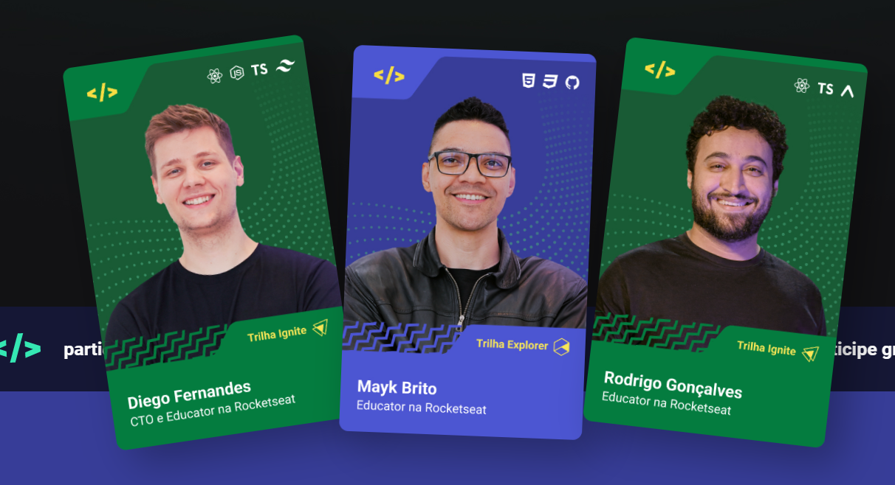
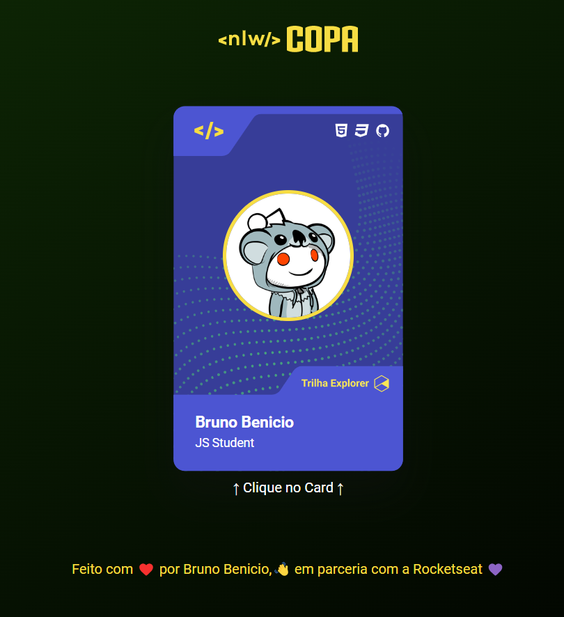

<h1 align="center"> Copa Card </h1>

Aquecimento para o Evento NLW Copa.

  <a href="#-tecnologias">Tecnologias</a>&nbsp;&nbsp;&nbsp;|&nbsp;&nbsp;&nbsp;
  <a href="#-projeto">Projeto</a>&nbsp;&nbsp;&nbsp;|&nbsp;&nbsp;&nbsp;
  <a href="#-layout">Layout</a>&nbsp;&nbsp;&nbsp;|&nbsp;&nbsp;&nbsp;
  <a href="#memo-licença">Licença</a>

  

### Link da página: [Clique aqui](https://copacard.vercel.app/).

 

  <h3 align="center">Figurinha do Evento</h3>
  
  
   
  <h3 align="center">Variação 01 da Figurinha Replicada</h3>
  

   
  <h3 align="center">Variação 02 da Figurinha Replicada</h3>
  

## 🚀 Tecnologias

Esse projeto foi desenvolvido com as seguintes tecnologias:

- HTML e CSS
- JavaScript (DOM)

## 💻 Projeto

Aproveitando que estamos em clima da copa do mundo, o professor Mayk Brito (Educador na Rocketseat) nos ensinou a replicar o cartão mostrado no site do evento (NLW COPA) que iniciará no dia 31/10/2022.

O cartão tem 2 variações, basta clicar no cartão que a mágica acontece.

 

---
Feito com ❤️ por Bruno Benicio :wave: em parceria com a Rocketseat 💜
