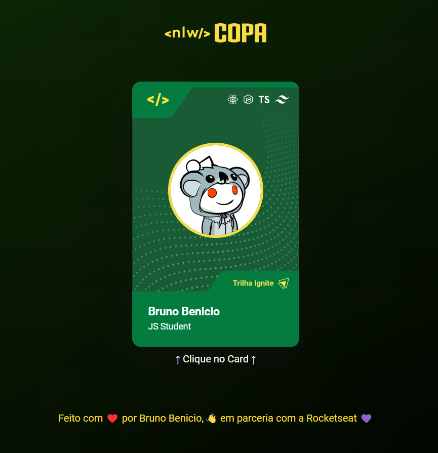

<h1 align="center"> Copa Card </h1>

Aquecimento para o Evento NLW Copa.

  <a href="#-tecnologias">Tecnologias</a>&nbsp;&nbsp;&nbsp;|&nbsp;&nbsp;&nbsp;
  <a href="#-projeto">Projeto</a>&nbsp;&nbsp;&nbsp;&nbsp;|&nbsp;&nbsp;
  <a href="#-layout">Layout</a>&nbsp;&nbsp;&nbsp;&nbsp;&nbsp;&nbsp;

### Link da página: [Clique aqui](https://copacard.vercel.app/).

 

  <h3 align="center">Figurinha do Evento</h3>
  
  
   
  <h3 align="center">Variação 01 da Figurinha Replicada</h3>
  

   
  <h3 align="center">Variação 02 da Figurinha Replicada</h3>
  
  
   
  <h3 align="center">Video Demonstração</h3>
  

https://user-images.githubusercontent.com/53373326/198835228-1f1429f6-b02e-4151-ad2f-905d5d34b376.mp4

## 🚀 Tecnologias

Esse projeto foi desenvolvido com as seguintes tecnologias:

- HTML e CSS
- JavaScript (DOM)

## 💻 Projeto

Aproveitando que estamos em clima da copa do mundo, o professor Mayk Brito (Educador na Rocketseat) nos ensinou a replicar o cartão mostrado no site do evento (NLW COPA) que iniciará no dia 31/10/2022.

O cartão tem 2 variações, basta clicar nele que a mágica acontece.

## 🔖 Layout

Você pode visualizar o layout original do projeto através [DESSE LINK](https://www.figma.com/file/mp9GzszqeMtxentvNyuBCg/NLW-Copa-Card?node-id=0%3A1).

---
Feito com ❤️ por Bruno Benicio :wave: em parceria com a Rocketseat 💜
